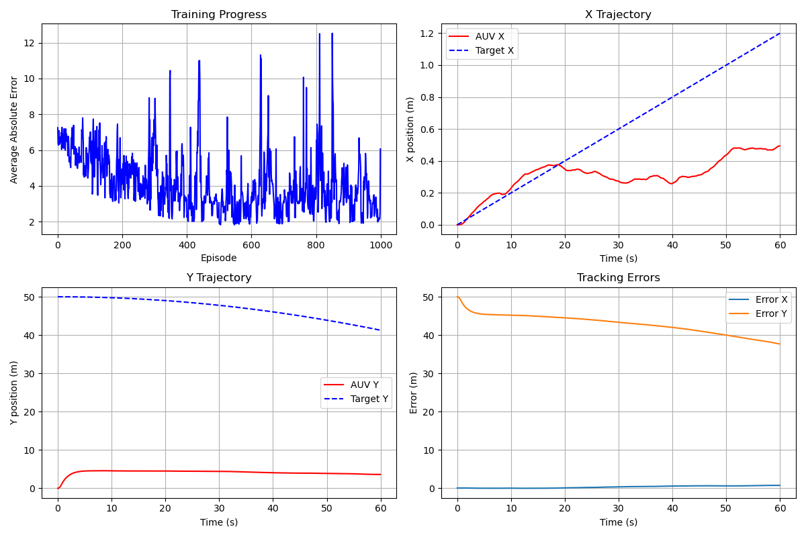

# Reinforcement Learning Based AUV Trajectory Tracking Control

This project reproduces a reinforcement learning based adaptive PID controller for trajectory tracking of Autonomous Underwater Vehicles (AUV).

The method combines **Q-learning and PID control** to adaptively tune controller parameters and improve trajectory tracking performance.

---

# Simulation Results

Top-left: training progress (average absolute tracking error)

Top-right: X-axis trajectory tracking

Bottom-left: Y-axis trajectory tracking

Bottom-right: trajectory tracking errors

---

# Abstract

Trajectory tracking is a fundamental task for autonomous underwater vehicles (AUVs). Traditional PID controllers are widely used in underwater robotics due to their simplicity and robustness. However, fixed PID parameters are often insufficient in uncertain underwater environments.

This project reproduces a reinforcement learning based control strategy that integrates **Q-learning with PID control** to adaptively tune controller parameters. The reinforcement learning agent observes trajectory tracking errors and updates the controller parameters to improve system performance.

Simulation results demonstrate that the adaptive controller can gradually reduce tracking errors and improve trajectory tracking capability.

---

# Method

The control framework integrates reinforcement learning with classical control.

Control architecture:

Q-learning Agent
↓
Adaptive PID Controller
↓
AUV Dynamics Model
↓
Trajectory Tracking

### PID Controller

The PID controller generates control input based on trajectory error:

τ = Kp * e + Ki * ∫e dt + Kd * de/dt

Where

- **e** : trajectory tracking error  
- **Kp Ki Kd** : PID controller parameters  

---

### Reinforcement Learning

A **Q-learning algorithm** is used to adaptively tune PID parameters.

State

trajectory tracking error
vehicle position

Action

adjust PID parameters
increase / decrease Kp Ki Kd

Reward

tracking error penalty

The Q-table is updated during training to learn optimal controller parameters.

---

# Simulation Environment

The simulation considers a simplified AUV trajectory tracking problem.

Target trajectory

x(t) = 0.02t
y(t) = 50cos(0.01t)

The controller learns to minimize trajectory tracking error during the simulation process.

---

# Project Structure

AUV-RL-Tracking-Control

main.py # reinforcement learning based control simulation
figures/
results.png # training and trajectory tracking results
README.md

---

# Run Simulation

Clone the repository and run

python main.py

The script runs the reinforcement learning based controller and generates trajectory tracking plots.

---

# Paper Reference

This project reproduces the method proposed in

Yan Jing, Li Wenbiao, Yang Xian, et al.

Tracking Control for AUV by Combining Q-Learning and PID Controller

Journal of Unmanned Undersea Systems, 2021.

---

# Future Work

Possible improvements include

- continuous control reinforcement learning methods (PPO / SAC)
- more accurate AUV hydrodynamic models
- 3D trajectory tracking
- real-world AUV experiments
- integration with robotics simulation frameworks such as ROS or PyBullet

---

# Keywords

Reinforcement Learning  
Robotics Control  
Autonomous Underwater Vehicle (AUV)  
Adaptive PID Controller  
Trajectory Tracking

---

# Author

Wei Wenhao  
Robotics Engineering Undergraduate  
Northeastern University (China)
